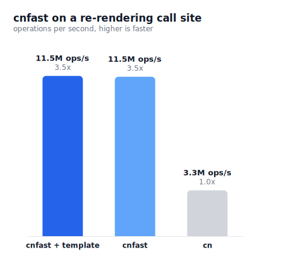

# cnfast

[](https://npmjs.com/package/cnfast)
[](https://npmjs.com/package/cnfast)

Fast drop-in replacement for `cn`.

cnfast runs **3.8x faster** on average than `tailwind-merge`, up to **7x** on component-heavy code, with byte-identical output. Same API, no code changes.

```ts
import { cn } from "cnfast";

cn("px-2 py-1", isActive && "px-4", { "text-red-500": hasError });
// "py-1 px-4 text-red-500"
```

## Install

```bash
npm install cnfast
```

Migrate an existing `clsx`, `classnames`, or `tailwind-merge` project in one command:

```bash
npx cnfast migrate
```

On a shadcn/ui project, add or replace your `cn` utility through the registry. This rewrites `lib/utils.ts` to re-export cnfast and installs the package:

```bash
npx shadcn@latest add aidenybai/cnfast/cn
```

## Usage

Swap the shadcn/ui `cn` helper for cnfast:

```ts
// before
import { clsx, type ClassValue } from "clsx";
import { twMerge } from "tailwind-merge";
export const cn = (...inputs: ClassValue[]) => twMerge(clsx(inputs));

// after
export { cn } from "cnfast";
```

cnfast also exports `clsx`, `twMerge`, and `twJoin`.

## Tagged templates

As a tagged template, `cn` caches by call-site identity, skipping the join and hash on every repeat. A stable call site runs 4.3x faster than `tailwind-merge`. The `cn(...)` call form already caches its arguments on V8, so on that engine the template form is only 1.2x ahead; the gap is wider on engines without that cache.

```ts
cn`px-2 px-4 ${isActive && "bg-blue-500"}`; // "px-4 bg-blue-500"
```

## Comparing against cn

cnfast produces byte-identical output to `tailwind-merge` and computes it faster, with the largest gains on re-rendering call sites where the same class arguments recur:



Across the wider suite, operations per second on V8 (Node and Chrome), best-of-3:

| Workload           | tailwind-merge        | cnfast       | Speedup  |
| ------------------ | --------------------- | ------------ | -------- |
| Cached re-render   | 2,025 ops/s           | 8,709 ops/s  | **4.3x** |
| Merge engine, cold | 1,440 ops/s           | 5,411 ops/s  | **3.8x** |
| Component corpus   | 1,585 ops/s           | 6,506 ops/s  | **4.1x** |
| Page render        | 4,249 ops/s           | 11,908 ops/s | **2.8x** |
| Live data grid     | 500 ops/s             | 2,185 ops/s  | **4.4x** |

Across 65 workloads the geometric mean is **3.8x**, with 0 mismatches over 113,291 real-world call groups. The bundle is 9.43 KB gzipped against 8.45 KB for the baseline. Figures come from V8; see the [benchmark suite](./packages/cnfast/bench/README.md) for the Bun breakdown and the per-engine caveats.

`cn` runs once per element, so its cost scales with how much you render. Server-rendering a large page calls it across the whole tree; a client app that re-renders often (data grids, virtualized tables, live dashboards) calls it thousands of times per second, where a faster `cn` keeps frames within budget. On a small or rarely updated page, the saving stays within run-to-run noise.

Regenerate the chart with `pnpm --filter cnfast bench:chart`. See the [architecture guide](./docs/architecture.md) for how it works.

## Development

```bash
pnpm install
pnpm build
pnpm test
```

## Credits

cnfast adapts MIT-licensed code from [clsx](https://github.com/lukeed/clsx) (Luke Edwards) and [tailwind-merge](https://github.com/dcastil/tailwind-merge) (Dany Castillo). See [LICENSE](./LICENSE).

## License

MIT

## Contributing

Thank you for your interest in contributing to cnfast! We welcome contributions from everyone. Please follow the guidelines below to help us maintain a high-quality project.

### How to Contribute
1. **Fork the repository**: Create a personal copy of the repository by forking it on GitHub.
2. **Clone your fork**: Clone your forked repository to your local machine.
3. **Create a new branch**: Use a descriptive name for your branch to indicate the feature or fix you are working on.
4. **Make your changes**: Implement your feature or fix, ensuring you follow the project's coding style and conventions.
5. **Run tests**: Ensure all tests pass by running the test suite.
6. **Commit your changes**: Write a clear and concise commit message following the conventional commits format.
7. **Push your changes**: Push your branch to your forked repository.
8. **Open a pull request**: Go to the original repository and create a pull request, describing your changes and why they should be merged.

### Code of Conduct
Please adhere to our Code of Conduct in all interactions within the project. We strive to create a welcoming and inclusive environment for all contributors.
